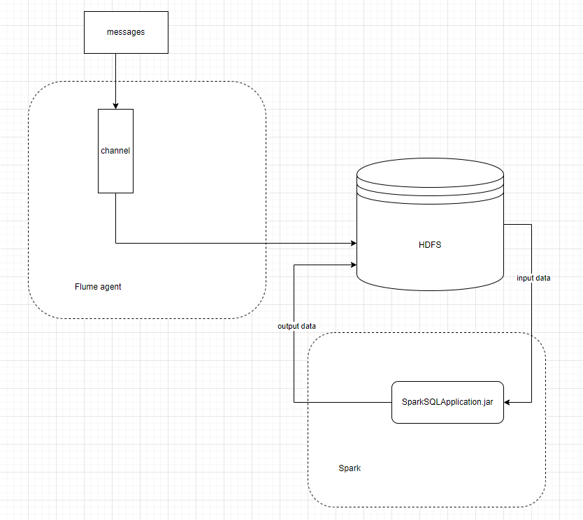

MEPHI_HM_2_2022
Скриншоты логов в папке screenshots

Условие
a)	Бизнес логика:
Программа должна подсчитывать среднее количество сообщений пользователей групп социальной сети, передаваемых друг-другу. Входные данные: справочник группа-пользователь, записи пользователь1-пользователь2-дата-текст. Выходные данные: группа-среднее количество сообщений на одного пользователя в группе.
b)	Технология подачи новых данных в систему:
		 Flume agent
c)	Технология хранения:
HDFS
d)	Технология обработки данных:
Spark SQL (DataFrame, DataSet)

Запускаем hdfs – sbin/start-dfs.sh из директории хадупа
Сперва скриптом generate.py генерируем: 
а) справочник вида группа-пользователь, который сохранится в .json файл (dict.json), 
б) текстовый файл с сообщениями пользователей вида: пользователь1-пользователь2-дата-текст.
	
После установки flume, создаем файл flume.conf и помещаем его в папку conf директории программы flume

agent1.sources = tail
agent1.channels = Channel-2
agent1.sinks = sink-1

agent1.sources.tail.type = exec

agent1.sources.tail.command = cat /root/lab2/scripts/messages.txt

agent1.sources.tail.channels = Channel-2

agent1.sinks.sink-1.channel = Channel-2
agent1.sinks.sink-1.type = hdfs

agent1.sinks.sink-1.hdfs.path = /user/root/messages11

agent1.sinks.sink-1.hdfs.fileType = DataStream
agent1.sinks.sink-1.hdfs.rollInterval = 60

agent1.channels.Channel-2.type = memory

agent1.channels.Channel-2.capacity = 10000

agent1.channels.Channel-2.transactionCapacity = 10000

Запускаем flume agent из директории программы flume с помощью команды
bin/flume-ng agent --conf --cp ./conf -f conf/flume.conf -n agent1 -Dflume.root.logger=DEBUG

Скриншоты Flume в папке screenshots

После того как данные загружены в HDFS запускаем нашу программу (spark предварительно должен быть установлен).
Для запуска программы выполняем программу, с указанием путей вводной папки (с сообщениями, которые мы переместили с помощью flume в hdfs) и выходной папки. Этот скрипт лежит в файле start-spark.sh в папке scripts

spark-submit --class bdtc.lab2.SparkSQLApplication --master local --deploy-mode client --executor-memory 1g --name wordcount --conf "spark.app.id=SparkSQLApplication" /root/.m2/repository/bdtc/lab2/1.0-SNAPSHOT/lab2-1.0-SNAPSHOT-jar-with-dependencies.jar hdfs://127.0.0.1:9000/user/root/messages11 output22

Скриншоты логов спарка в папке screenshots

Общая схема

